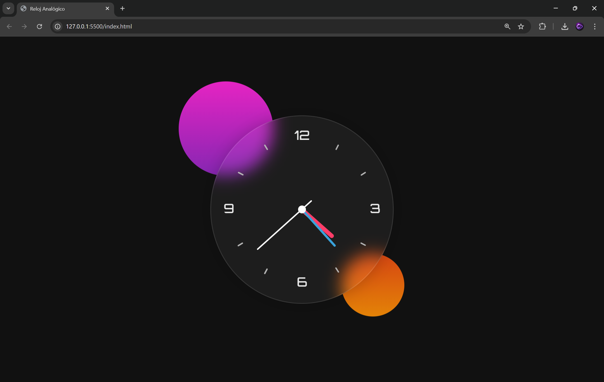

# 🕐 Reloj Analógico

Reloj analógico en tiempo real construido con HTML, CSS y JavaScript puro. Muestra las manecillas de hora, minuto y segundo animadas con rotación dinámica sobre un fondo glassmorphism con círculos decorativos animados.

---

## 📁 Estructura del proyecto

```
reloj/
├── index.html   → Estructura del reloj
├── estilo.css   → Estilos y animaciones
├── reloj.js     → Lógica del tiempo en JavaScript
├── clock.png    → Imagen de fondo del reloj (requerida)
└── README.md
```

---

## 🚀 Cómo usar

1. Clona o descarga el repositorio.
2. Coloca tu imagen `clock.png` (la esfera del reloj) en la misma carpeta.
3. Abre `index.html` en el navegador — no requiere servidor ni dependencias.

---

## ⚙️ Cómo funciona

`reloj.js` ejecuta un `setInterval` cada **1000ms** que:

1. Obtiene la hora actual con `new Date()`.
2. Calcula el ángulo de cada manecilla en grados:

| Manecilla | Cálculo |
|-----------|---------|
| Hora      | `horas × 30 + (minutos / 12)` |
| Minuto    | `minutos × 6` |
| Segundo   | `segundos × 6` |

3. Aplica la rotación vía `style.transform = rotateZ(Xdeg)`.

---

## 🎨 Diseño

- **Fondo:** `#111` oscuro
- **Reloj:** efecto *glassmorphism* con `backdrop-filter: blur` y borde semitransparente
- **Manecilla de hora:** roja `#ff3d68`, 8px de ancho
- **Manecilla de minuto:** azul `#39a2db`, 4px de ancho
- **Manecilla de segundo:** blanca `#fff`, 3px de ancho
- **Círculo decorativo 1:** gradiente púrpura/rosa, animación `mover-arriba`
- **Círculo decorativo 2:** gradiente naranja/rojo, animación `mover-abajo`

---

## 🐛 Bugs corregidos

| # | Archivo | Bug | Corrección |
|---|---------|-----|------------|
| 1 | `index.html` | Clase `contsiner` (typo) | → `contenedor` |
| 2 | `estilo.css` | `transfrom` en keyframe `mover-abajo` | → `transform` |
| 3 | `estilo.css` | `.reloj::before` sin `height` (punto invisible) | → `height: 15px` |
| 4 | `estilo.css` | JS pegado al final del CSS | → movido a `reloj.js` |
| 5 | `reloj.js` | `style.transfrom` ×3 | → `style.transform` |

---

## 🛠️ Tecnologías

- HTML5
- CSS3 (animaciones, glassmorphism, `backdrop-filter`)
- JavaScript ES6+ (arrow functions, template literals, `setInterval`)

## 📷 Captura


## 🌐 Pagina 
https://reloj-analogico-omega.vercel.app/